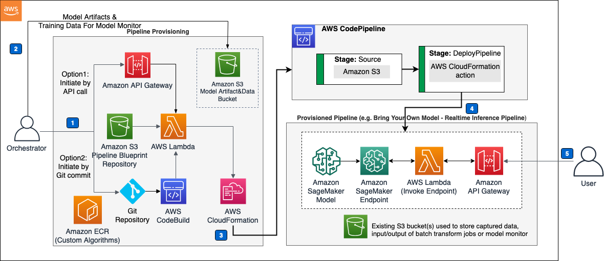
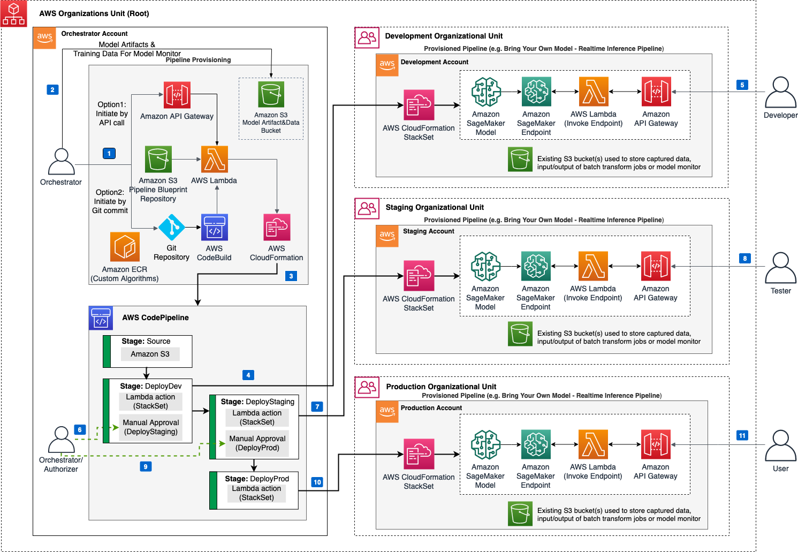

# mlops-workload-orchestrator

The machine learning (ML) lifecycle is an iterative and repetitive process that involves
changing models over time and learning from new data. As ML applications gain popularity,
organizations are building new and better applications for a wide range of use cases including
optimized email campaigns, forecasting tools, recommendation engines, self-driving vehicles,
virtual personal assistants, and more. While operational and pipelining processes vary greatly
across projects and organizations, the processes contain commonalities across use cases.

The solution helps you streamline and enforce architecture best practices by providing an extendable
framework for managing ML pipelines for Amazon Machine Learning (Amazon ML) services and third-party
services. The solution’s template allows you to train models, upload trained models, configure the orchestration of
the pipeline, initiate the start of the deployment process, move models through different stages of
deployment, and monitor the successes and failures of the operations. The solution also provides a
pipeline for building and registering Docker images for custom algorithms that can be used for model
deployment on an [Amazon SageMaker](https://aws.amazon.com/sagemaker/) endpoint.

You can use batch and real-time data inferences to configure the pipeline for your business context.
You can also provision multiple data quality, model quality, model bias, and model explainability Monitor
pipelines to periodically monitor the quality of deployed Amazon SageMaker ML models. This solution
increases your team’s agility and efficiency by allowing them to repeat successful processes at scale.

#### Benefits

- **Leverage a pre-configured machine learning pipeline:** Use the solution's reference architecture to initiate a pre-configured pipeline through an API call or a Git repository.
- **Automatically train, deploy, and monitor models:** Use the solution's pipelines to automate the model training. Deliver an inference endpoint with model drift detection packaged as a serverless microservice.

---

## Architecture

This solution is built with two primary components: 1) the orchestrator component, created by deploying the solution’s AWS CloudFormation template, and 2) the AWS CodePipeline instance deployed from either calling the solution’s API Gateway, or by uploading a configuration file to an Amazon S3 bucket. The solution’s pipelines are implemented as AWS CloudFormation templates, which allows you to extend the solution and add custom pipelines.

To support multiple use cases and business needs, the solution provides two AWS CloudFormation templates: **option 1** for single account deployment, and **option 2** for multi-account deployment. In both templates, the solution provides the option to use Amazon SageMaker Model Registry to deploy versioned models.

### Template option 1: Single account deployment

The solution’s single account architecture allows you to provision ML pipelines in a single AWS account.



### Template option 2: Multi-account deployment

The solution uses [AWS Organizations](https://aws.amazon.com/organizations/) and [AWS CloudFormation StackSets](https://docs.aws.amazon.com/AWSCloudFormation/latest/UserGuide/what-is-cfnstacksets.html) to allow you to provision or update ML pipelines across AWS accounts. Using an AWS Organizations administrator account (a delegated administrator account or the management account), also referred to as the orchestrator account, allows you to deploy ML pipelines implemented as AWS CloudFormation templates into selected target accounts (for example, development, staging, and production accounts).



---

## File Structure

Upon successfully cloning the repository into your local development environment but **prior** to running the initialization script, you will see the following file structure in your editor:

```
├── CHANGELOG.md
├── CODE_OF_CONDUCT.md
├── CONTRIBUTING.md
├── LICENSE.txt
├── NOTICE.txt
├── README.md
├── SECURITY.md
├── deployment                [folder containing build/test scripts]
│   ├── build-s3-dist.sh
│   ├── run-unit-tests.sh
│   ├── cdk-solution-helper
└── source
    ├── infrastructure        [folder containing CDK code and lambdas for ML pipelines]
    │   ├── lib
    │   │   ├── blueprints
    │   │   │   ├── aspects
    │   │   │   ├── lambdas
    │   │   │   │   ├── batch_transform
    │   │   │   │   ├── create_baseline_job
    │   │   │   │   ├── create_model_training_job
    │   │   │   │   ├── create_sagemaker_autopilot_job
    │   │   │   │   ├── create_update_cf_stackset
    │   │   │   │   ├── inference
    │   │   │   │   ├── invoke_lambda_custom_resource
    │   │   │   │   └── sagemaker_layer
    │   │   │   ├── ml_pipelines
    │   │   │   └── pipeline_definitions
    |   |   ├── utils
    |   |   |   └── cfnguard_helper.py
    │   │   └── mlops_orchestrator_stack.py
    │   └── test             [folder containing CDK unit tests]
    ├── lambdas              [folder containing lambdas for the main templates]
    │   ├── custom_resource
    │   ├── pipeline_orchestration
    │   └── solution_helper
    ├── requirements-test.txt
    └── requirements.txt
```

## Creating a custom build

### Prerequisites

- Python 3.10
- [AWS Command Line Interface](https://aws.amazon.com/cli/)
- Docker (required to build the AWS Lambda layer for Amazon SageMaker SDK)

### 1. Clone the repository

Clone this git repository.

`git clone https://github.com/aws-solutions/mlops-workload-orchestrator.git`

---

### 2. Build the solution for deployment

- To run the unit tests

```
cd <rootDir>/deployment
chmod +x ./run-unit-tests.sh
./run-unit-tests.sh
```

- Determine the name of a target Amazon S3 distribution bucket that should be created in your account, the name should be suffixed with the region that the deployment will be made in, example my-solution-name-<region> such as my-solution-name-us-east-1
- Create the bucket in the target account
- Set environment variables in your shell as follows, note that *DIST_OUTPUT_BUCKET* should not include the region suffix of the bucket name, that will be automatically appended later
- SOLUTION_NAME - The name of This solution (example: mlops-workload-orchestrator)
- VERSION - The version number of the change


```
export DIST_OUTPUT_BUCKET=my-bucket-name
export SOLUTION_NAME=my-solution-name
export VERSION=my-version
```

- Now build the distributable:

```
cd <rootDir>/deployment
chmod +x ./build-s3-dist.sh
./build-s3-dist.sh $DIST_OUTPUT_BUCKET $SOLUTION_NAME $VERSION
```

- Upload the distributable assets to your Amazon S3 bucket in your account. Note: ensure that you own the Amazon S3 bucket before uploading the assets. To upload the assets to the S3 bucket, you can use the AWS Console or the AWS CLI as shown below.

```
aws s3 cp ./global-s3-assets/ s3://$DIST_OUTPUT_BUCKET-<aws_region>/$SOLUTION_NAME/$VERSION/ --recursive --acl bucket-owner-full-control --profile aws-cred-profile-name
aws s3 cp ./regional-s3-assets/ s3://$DIST_OUTPUT_BUCKET-<aws_region>/$SOLUTION_NAME/$VERSION/ --recursive --acl bucket-owner-full-control --profile aws-cred-profile-name
```

- In the destination bucket under the solution name and version folders, there should be templates for single and multi-region deployments. These will end with a *.template* suffix.
- Copy the *Object URL* link for the preferred deployment architecture.
- Create the deployment using CloudFormation with the template link.

---


## Uninstall the solution

Please refer to the [Uninstall the solution section](https://docs.aws.amazon.com/solutions/latest/mlops-workload-orchestrator/uninstall-the-solution.html) in the [solution's implementation guide](https://docs.aws.amazon.com/solutions/latest/mlops-workload-orchestrator/welcome.html).

## Collection of operational metrics

This solution collects anonymized operational metrics to help AWS improve the quality and features of the solution. For more information, including how to disable this capability, please see the [implementation guide](https://docs.aws.amazon.com/solutions/latest/mlops-workload-orchestrator/operational-metrics.html).

## Known Issues

### Image Builder Pipeline may fail due to Docker Hub rate limits

When building custom model container that pulls public docker images from Docker Hub in short time period, you may occasionally face throttling errors with an error message such as:
` toomanyrequests You have reached your pull rate limit. You may increase the limit by authenticating and upgrading: https://www.docker.com/increase-rate-limit`

This is due to Docker Inc. [limiting the rate at which images are pulled under Docker Hub anonymous and free plans](https://docs.docker.com/docker-hub/download-rate-limit/). Under the new limits of Dockerhub, free plan anonymous use is limited to 100 pulls per six hours, free plan authenticated accounts limited to 200 pulls per six hours, and Pro and Team accounts do not see any rate limits.

For more information regarding this issue and short-term and long-term fixes, refer to this AWS blog post: [Advice for customers dealing with Docker Hub rate limits, and a Coming Soon announcement](https://aws.amazon.com/blogs/containers/advice-for-customers-dealing-with-docker-hub-rate-limits-and-a-coming-soon-announcement/)

---

Copyright Amazon.com, Inc. or its affiliates. All Rights Reserved.

Licensed under the Apache License Version 2.0 (the "License"). You may not use this file except in compliance with the License. A copy of the License is located at

    http://www.apache.org/licenses/

or in the "license" file accompanying this file. This file is distributed on an "AS IS" BASIS, WITHOUT WARRANTIES OR CONDITIONS OF ANY KIND, express or implied. See the License for the specific language governing permissions and limitations under the License.
